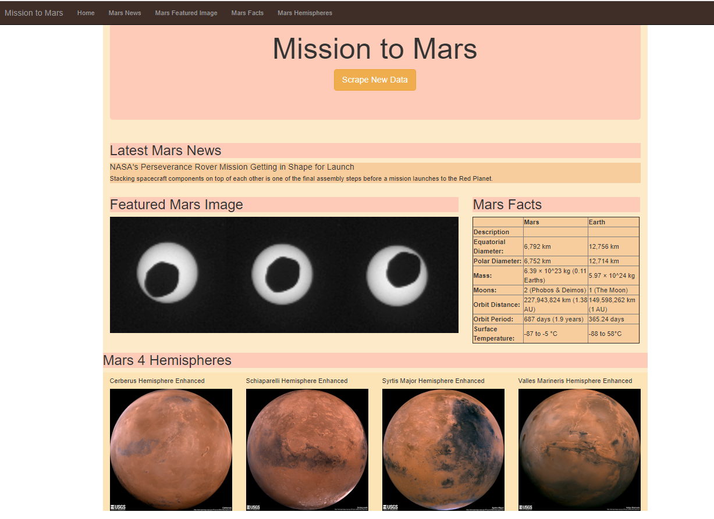
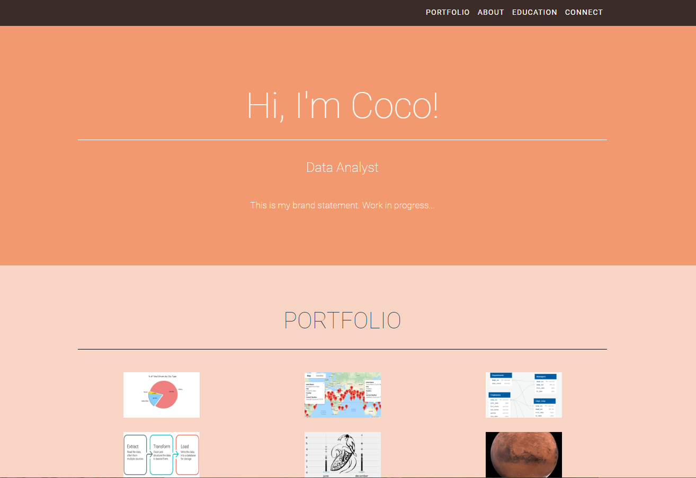
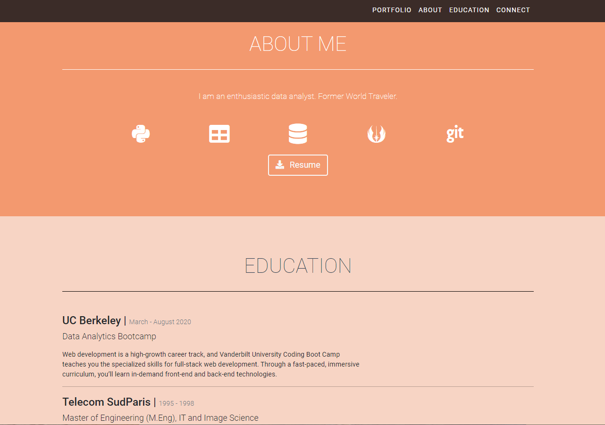

# 10-Mission-to-Mars
Module 10: Mission to Mars - Web Scraping with HTML/CSS

## Project/Challenge Overview
We've been tasked to put together a web-scraping project about Nasa's Mission to Mars, gathering the latest news article, image, and facts, as well as the 4 high-resolution images of the 4 hemispheres.

## Resources
- Python 3.7.6, Anaconda 4.8.3, Jupyter Notebook, VSCode
- Splinter, Beautiful Soup, ChromeDriver, MongoDB, HTML 5, CSS, Bootstrap 3.3.7
- https://mars.nasa.gov/news - https://space-facts.com/mars/ - https://astrogeology.usgs.gov/search/results?q=hemisphere+enhanced&k1=target&v1=Mars

## Challenge Summary
Using Splinter and Beautiful Soup, we are scraping:
- the latest news title and article summary from the NASA website
- the latest picture from the NASA picture website
- the facts table for Mars and Earth from the space facts website
- the pictures and names of the 4 Mars hemispheres

and uploading them all to our MangoDB to be displayed on our webpage, using Bootstrap.

We also started to work on our Portfolio, using one of the provided templates. Work in progress.

 

